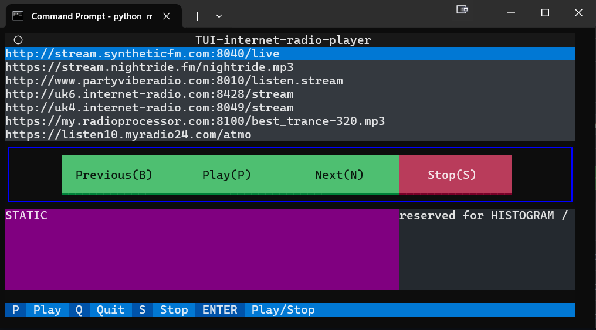

Internet radio player with Textual interface.
To edit the radiostation list, modify STATIONLIST below.
Not all stream types are working, unfortunately.
pls/m3u/etc playlists not supported. Only mp3 streams accepted.

HOW TO RUN:
run "pip install requriements.txt" (miniaudio, textual)
run "python main.py"

recommended Windows Terminal

TODO - next and previous buttons

TODO - histogram for the audio stream. Don't know how to start
seems miniaudio has no such option? or something like  DecodedSoundFile?
maybe from the system volume/mixer?
for display, maybe sparkines?

TODO - while no histogram, make 'press/event' indicator there
